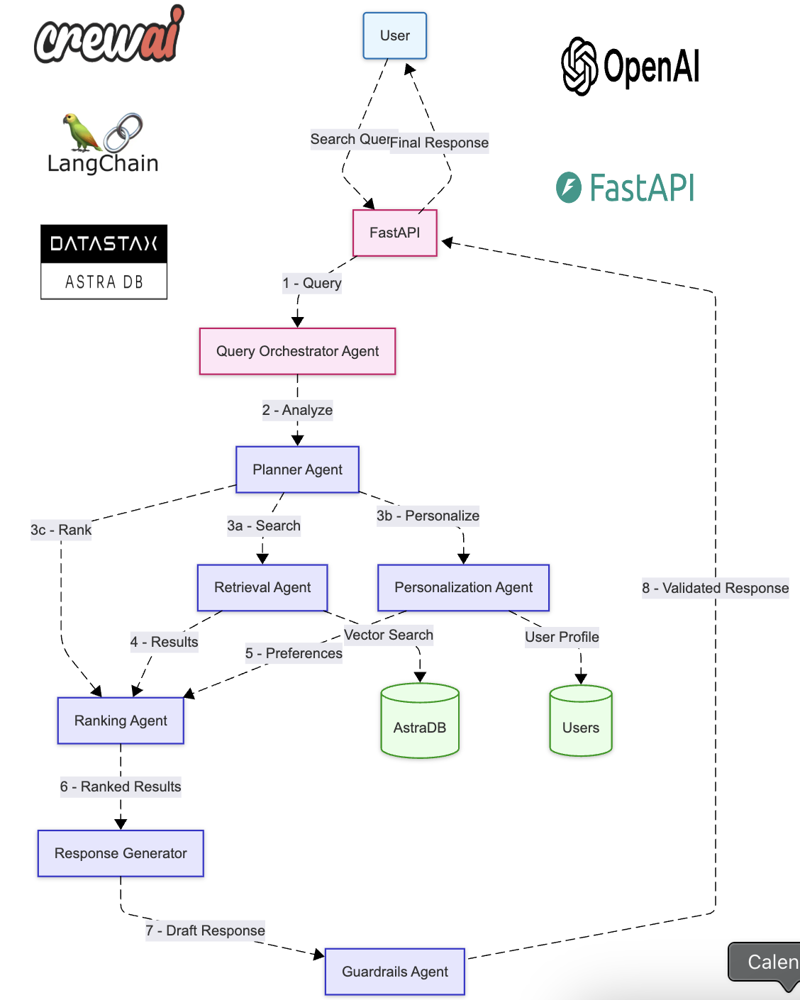

# Multi Agent Conversational Search

A Multi Agent Conversational product search system that uses multiple AI agents to provide personalized search results. The system combines vector search, natural language processing, and multi-agent coordination to deliver relevant product recommendations.

[](https://github.com/ahsanblock/Multi-Agent-Conversational-Search/stargazers)
[](https://github.com/ahsanblock/Multi-Agent-Conversational-Search/network/members)
[](https://github.com/ahsanblock/Multi-Agent-Conversational-Search/issues)
[](https://github.com/ahsanblock/Multi-Agent-Conversational-Search/blob/main/LICENSE)

## System Architecture

Below is the high-level architecture of our multi-agent system:

<div align="center">
  
</div>

## Demo


## Features

- 🤖 Multi-agent architecture using CrewAI
- 🔍 Vector search with AstraDB
- 🎯 Personalized search results
- 💬 Natural language query processing
- 🎨 Modern, responsive UI
- ⚡ Fast API backend

## Tech Stack

- **Backend**:
  - FastAPI
  - Python 3.9+
  - CrewAI
  - LangChain
  - OpenAI Embeddings

- **Database**:
  - AstraDB (Vector Database)

- **Frontend**:
  - HTML/CSS/JavaScript
  - TailwindCSS
  - Responsive Design

## Getting Started

### Prerequisites

- Python 3.9 or higher
- AstraDB account
- OpenAI API key

### Installation

1. Clone the repository:
   ```bash
   git clone https://github.com/yourusername/multi-agent-conversational-search.git
   cd multi-agent-conversational-search
   ```

2. Create and activate a virtual environment:
   ```bash
   python -m venv venv
   source venv/bin/activate  # On Windows: venv\Scripts\activate
   ```

3. Install dependencies:
   ```bash
   pip install -r requirements.txt
   ```

4. Create a .env file:
   ```env
   OPENAI_API_KEY=your_openai_api_key
   ASTRA_DB_TOKEN=your_astradb_token
   ASTRA_DB_ENDPOINT=your_astradb_endpoint
   ```

### Running the Application

1. Start the server:
   ```bash
   python3 -m uvicorn src.main:app --reload --port 8002
   ```

2. Open your browser and navigate to:
   ```
   http://localhost:8002
   ```

## Project Structure

```
├── src/
│   ├── agents/
│   │   ├── planner.py
│   │   ├── retrieval.py
│   │   ├── personalization.py
│   │   ├── ranking.py
│   │   └── response_generator.py
│   ├── config/
│   │   └── settings.py
│   ├── models/
│   │   └── schemas.py
│   └── main.py
├── ui/
│   ├── index.html
│   └── static/
│       ├── script.js
│       └── styles.css
├── requirements.txt
└── README.md
```

## Setting Up the Database

1. Create an AstraDB account and database
2. Create a vector collection:
   ```python
   from astrapy.db import AstraDB

   db = AstraDB(
       token="your_token",
       api_endpoint="your_endpoint"
   )

   # Create vector collection
   db.create_collection(
       collection_name="product_search",
       dimension=1536  # OpenAI embedding dimension
   )
   ```

## Search Examples

The system supports various types of natural language queries:

- **Price-based**: "gaming laptop under $2000"
- **Feature-based**: "laptops with longest battery life"
- **Use-case**: "best laptop for graphic design"
- **Comparison**: "compare MacBook Pro M2 vs Dell XPS 15"
- **Brand-specific**: "ASUS ROG gaming laptops"
- **Specific Requirements**: "ultralight laptop under 3 pounds with good battery"

## Contributing

We love your input! We want to make contributing to Multi Agent Conversational Search as easy and transparent as possible, whether it's:

- Reporting a bug
- Discussing the current state of the code
- Submitting a fix
- Proposing new features
- Becoming a maintainer

### Ways to Contribute

1. Fork the repository
2. Create your feature branch (`git checkout -b feature/amazing-feature`)
3. Commit your changes (`git commit -m 'Add amazing feature'`)
4. Push to the branch (`git push origin feature/amazing-feature`)
5. Open a Pull Request

### Show Your Support

If you find this project useful, please consider giving it a ⭐️ on GitHub! It helps the project grow and attract more contributors.

You can also:
- Share the project with others
- Create blog posts about it
- Mention it in your presentations
- Follow updates and releases

### Development Discussion

Have an idea or question? Start a [Discussion](https://github.com/yourusername/Multi-Agent-Conversational-Search/discussions) or join our existing ones. We'd love to hear from you!

## License

This project is licensed under the MIT License - see the [LICENSE](LICENSE) file for details.

## Acknowledgments

- CrewAI for multi-agent orchestration
- OpenAI for embeddings
- AstraDB for vector search capabilities
- FastAPI for the backend framework
- TailwindCSS for styling
- All our amazing contributors! 🌟 